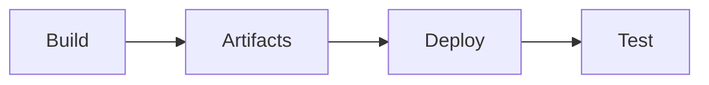

# Ensuring Quality Releases with Azure DevOps

[](https://dev.azure.com/mathew0179/Ensuring-Quality-Releases-DevOps/_build/latest?definitionId=13&branchName=main)


## Overview

This project demonstrates a comprehensive **CI/CD pipeline** using Azure DevOps, implementing automated quality assurance testing across multiple testing disciplines. It showcases the creation of cloud infrastructure using Infrastructure as Code (IaC), continuous deployment, and automated testing strategies to ensure quality software releases.


## Features

- **Infrastructure as Code (IaC)** - Automated Azure resource provisioning using Terraform
- **Continuous Integration/Continuous Deployment** - Fully automated Azure DevOps pipeline
- **Performance Testing** - JMeter stress and endurance tests
- **API Testing** - Postman integration and validation tests
- **UI Testing** - Selenium functional browser automation tests
- **Automated Deployment** - Azure Web App deployment with artifact management

## Architecture

The solution deploys and tests the following Azure resources:

| Resource | Description |
|----------|-------------|
| Resource Group | Container for all Azure resources |
| Virtual Network | Network infrastructure with subnets |
| Network Security Group | Network traffic filtering rules |
| Public IP | External access endpoint |
| App Service | Hosts the FakeRestAPI application |
| Virtual Machine | Executes Selenium UI tests |

## Repository Structure

```
├── automatedtesting/
│   ├── jmeter/              # JMeter performance test plans
│   │   ├── Stress_test.jmx      # Stress testing configuration
│   │   └── Endurance_test.jmx   # Endurance testing configuration
│   ├── postman/             # Postman API test collections
│   │   ├── regressiontest.json
│   │   ├── validationtest.json
│   │   └── validationtestenv.postman_environment.json
│   └── selenium/            # Selenium UI test scripts
│       └── uitest.py
├── devops/
│   └── pipelines/
│       └── azure-pipelines.yml  # Azure DevOps pipeline definition
├── fakerestapi/             # Sample .NET REST API application
├── terraform/
│   ├── environments/
│   │   └── test/            # Test environment configuration
│   └── modules/             # Reusable Terraform modules
│       ├── appservice/
│       ├── network/
│       ├── networksecuritygroup/
│       ├── publicip/
│       ├── resource_group/
│       └── vm/
└── screenshots/             # Documentation assets
```

## Getting Started

### Prerequisites

- [Azure Subscription](https://azure.microsoft.com/free/)
- [Azure DevOps Account](https://dev.azure.com/)
- [Terraform](https://www.terraform.io/downloads.html) v0.13+
- [Azure CLI](https://docs.microsoft.com/cli/azure/install-azure-cli)

### Setup Instructions

1. **Clone the repository**
   ```bash
   git clone https://github.com/mhaywardhill/Ensuring-Quality-Releases-DevOps.git
   cd Ensuring-Quality-Releases-DevOps
   ```

2. **Configure Azure DevOps**
   - Create a new project in Azure DevOps
   - Import this repository
   - Set up service connections for Azure Resource Manager
   - Create variable groups: `terraform-group` and `pl-group`

3. **Configure Terraform Backend**
   - Create an Azure Storage Account for Terraform state
   - Update backend configuration in `terraform/environments/test/main.tf`

4. **Upload Secure Files**
   - Upload `terraform.tfvars` to Azure DevOps secure files
   - Upload SSH key (`id_rsa`) for VM access

5. **Run the Pipeline**
   - Navigate to Pipelines in Azure DevOps
   - Create a new pipeline using `devops/pipelines/azure-pipelines.yml`
   - Run the pipeline

## Testing Strategy

### Performance Testing (JMeter)

| Test Type | Description |
|-----------|-------------|
| **Stress Test** | Evaluates system behavior under extreme load conditions |
| **Endurance Test** | Validates system stability over extended periods |

### API Testing (Postman)

| Test Suite | Description |
|------------|-------------|
| **Regression Tests** | Ensures existing functionality remains intact |
| **Validation Tests** | Verifies API responses meet specifications |

### UI Testing (Selenium)

Automated functional tests that:
- Navigate to the demo application
- Perform login operations
- Add items to cart
- Remove items from cart
- Validate UI interactions

## Pipeline Stages



| Stage | Description |
|-------|-------------|
| **Build** | Provisions infrastructure using Terraform |
| **Artifacts** | Packages application and test files |
| **Deploy** | Deploys FakeRestAPI to Azure Web App |
| **Test** | Executes automated tests |

## Technologies Used

- **Cloud Platform**: Microsoft Azure
- **CI/CD**: Azure DevOps Pipelines
- **Infrastructure as Code**: Terraform
- **Performance Testing**: Apache JMeter
- **API Testing**: Postman/Newman
- **UI Testing**: Selenium WebDriver (Python)
- **Application**: ASP.NET Web API

<details>
<summary><strong>License</strong></summary>

This project is licensed under the MIT License - see the [LICENSE](LICENSE) file for details.

</details>
